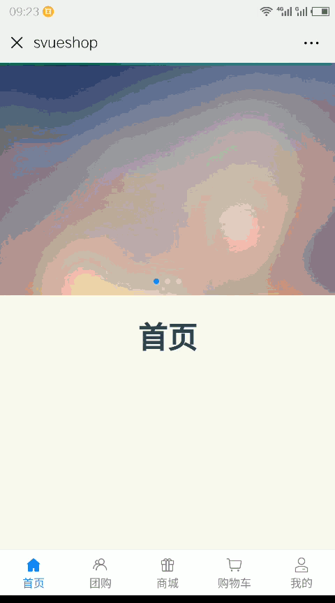
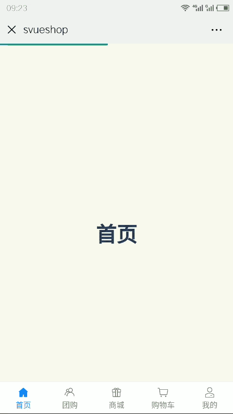

[](https://raw.githubusercontent.com/jaweii/vueg/master/image/vueg.JPG)


<p align="center">
    <a href="https://github.com/996icu/996.ICU/blob/master/LICENSE">
        
    </a>
</p>
<br>

## 修改版 shirne 2019/11/04
Forked from: [jaweii/Vueg----page-transition-plugin](https://github.com/jaweii/Vueg----page-transition-plugin)<br />
移除原来的记录离开路由的方法, 和根据路径深度判断进退的方法, 修改为记录路由历史, 并增加ts types<br />
判断转场效果逻辑:
```
1.先判断是否初始化
2.优先从map判断, 有逻辑则忽略后续的先后判断
3.如果设置了根页面,从其它页面切换到根页面总是使用离场效果
4.从路由历史搜索, 有记录则设置为后退, 无记录设为前进
5.调整路由历史记录, 已存在则切除之后的路由, 不存在则存入新的

其它功能和设置不变
```
## 多页面场景切换效果
注意: 区别在我的页面再进二级页面后的返回效果
|VuegHistory效果|Vueg效果|
|:---:|:---:|
|||

## Example：


## 使用方法

#### 安装插件

```js
npm i vueg-history --save
```

#### 引入插件
```js
import vueg from 'vueg-history'

Vue.use(vueg, new Router(), Options) // 传入实例化后的router, Options为可选的插件配置

```
#### 插件指令
插件注册了名为`v-transition`的指令，接收一个可选的Options参数，其包含的配置优先级高于全局配置。

#### 启用插件：

为`router-view`添加`v-transition`指令后，该`router-view`下所有的页面都将启用动画：
```js
<router-view v-transition></router-view>
```
或，为`template`中的顶级标签添加`v-transition`指令后，该页面组件将启用动画效果:
```js
<template>
    <page v-transition>
    </page>
</template>
```

支持Nuxt。


---

## Options

```js
@property {number} duration 动画时长。默认为0.3
@property {string} enter 入场动画，默认为'fadeInRight'
@property {string} leave 离场动画，默认为'fadeInLeft'
@property {boolean} useDepths 是否启用深度匹配。默认为false
@property {boolean} shadow 是否为入场页面添加阴影。默认为true
@property {Object} roots 根页面列表 从其它页面切换到根页面,总是使用离场效果。不影响map中匹配的效果 
@property {Object} map 默认为空情况下，vueg根据url深度判断是入场还是离场，但有时可能并不是你想要的效果，这时你可以使用map选项。
例子：`
roots: ['index','user'],
map: {
 'user-login':{
    enter: ['user-register'],
    leave: ['index'],
    disable: ['user-login-sms']
  }
 }
 `
上面例子表示，从名为`user-login`的路由到名为`user-regiseter`的路由转场，使用入场动画，反之则使用离场动画。
从名为`user-login`的路由到名为`index`的路由转场，使用离场动画，反之则使用入场动画。
从名为`user-login`的路由到名为`user-login-sms`的路由转场，禁用转场动画。


```

`enter`、`leave` 参数使用的animate.css的动画类名作为值，查看全部可用值，请访问：[https://daneden.github.io/animate.css](https://daneden.github.io/animate.css)。
另外插件自带了一个可用值 `touchPoint`，动画效果为页面从触摸(点击)点放大入场。

